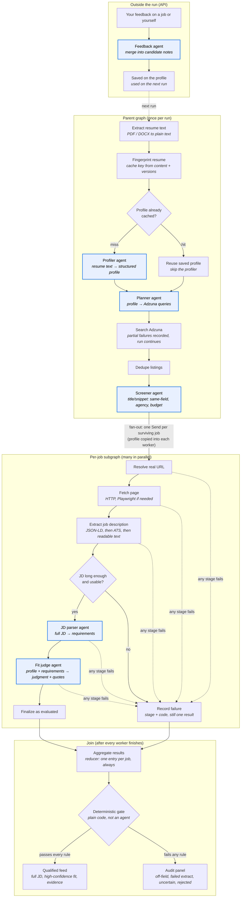

# Resume Job Matcher

Upload your resume and get back only the jobs you actually qualify for.

Most job boards show you everything that matches a keyword. This does the opposite. It
searches live postings, opens each one, reads the full job description, and compares it
against your resume. A job only reaches your feed if the description was genuinely
retrieved and your resume meets what it asks for. Every match comes with the quotes from
your resume that back it up, so you can see why it thinks you're a fit and disagree if
you're not.

Everything it rules out is still there in an audit panel, with the reasoning, so you can
tell the difference between "nothing matched" and "something went wrong."

## What you can do with it

- **Upload a resume** (PDF, DOCX, or plain text) and run a search.
- **Reuse a resume** you've already uploaded. Parsing is the slow part, so a saved resume
  starts searching immediately.
- **Steer the search.** Choose which locations to cover, whether to include nationwide
  results, how recent a posting has to be, and whether recruitment agency listings count.
- **Push back.** If a match is wrong, or a rejection is wrong, say so. Your feedback is
  distilled into a short list of notes the matcher applies to your next run. You can read
  that list, add to it, and delete anything you disagree with.
- **See what it cost.** Each run reports what it spent on model calls, in dollars.

## Getting started

You'll need:

- [uv](https://docs.astral.sh/uv/) for the Python side. It fetches Python 3.11 for you.
- [bun](https://bun.com/) for the web side. No separate Node install needed.
- An [OpenRouter](https://openrouter.ai/) API key, for the models that read resumes and
  job descriptions.
- An [Adzuna](https://developer.adzuna.com/) `app_id` and `app_key`, for finding jobs.

### With Docker (simplest)

```bash
cp .env.example packages/api/.env     # then fill in your three keys
docker compose up --build
```

Open http://localhost:3000.

### Running it directly

```bash
# API
cd packages/api
uv sync
uv run playwright install chromium     # needed for job pages that render with JavaScript
# on Linux, also: uv run playwright install-deps
cp ../../.env.example .env             # config.py reads packages/api/.env specifically
uv run uvicorn jdparser.server:app --port 8000

# web, in a second terminal
cd packages/web
bun install
echo 'NEXT_PUBLIC_API_BASE=http://localhost:8000' > .env.local
bun run dev
```

Open http://localhost:3000.

There's also a command line version, handy for a quick check without the browser:

```bash
cd packages/api && uv run python -m jdparser path/to/resume.pdf
```

## Your first run

Upload a resume and give it a few minutes. It's opening and reading real job pages one by
one, so a run usually takes two to three minutes, and the page updates as it goes.

When it finishes you should see job cards with the company, the title, a link to the real
posting, and a quote from your resume for each requirement it counted as met. If a job
card looks wrong, "Not a fit?" tells the matcher why, and it'll remember for next time.

Underneath, the audit panel accounts for everything else: jobs whose description couldn't
be retrieved, jobs the judge wasn't confident enough about, and jobs filtered out before
evaluation as being in a different field. Nothing disappears silently.

Upload the same resume a second time and it will say it reused your saved profile,
skipping the slowest step.

## Tuning

Each model call is configurable through environment variables, if you want to spend more
on a better answer or less on a faster one. Set any of
`LLM_MODEL_<NODE>`, `LLM_TEMP_<NODE>`, `LLM_MAX_TOKENS_<NODE>`, or `LLM_REASONING_<NODE>`,
where `<NODE>` is one of `PROFILER`, `PLANNER`, `JD_PARSER`, `JUDGE`, `SCREENER`, or
`FEEDBACK`.

For example, `LLM_REASONING_JUDGE=high` makes the fit judge think harder about each job.
`max_tokens` is a ceiling rather than a reservation, so raising it costs nothing unless
the extra room actually gets used.

Search breadth is tunable too. `SEARCH_PLAN_MAX_QUERIES` controls how many distinct role
searches it runs, and `SCREEN_EVAL_CAP` caps how many jobs get the expensive full
evaluation. Both are listed with the rest in `.env.example`.

## Good to know

A few things work simply on purpose, and are worth knowing before you rely on them:

- **It's built for one person on one machine.** There are no accounts or logins, and
  everything is stored under a single local user.
- **Your data stays in files on disk.** Resumes, saved profiles, and run history are JSON
  files under `packages/api/data/`, not a database. Under Docker they live in a volume
  called `jdparser-data`, and `docker compose down -v` deletes them.
- **US listings only.** Adzuna supports other countries, but the country is currently
  fixed.
- **Results arrive by refreshing, not streaming.** The page checks for progress every two
  seconds and gives up after five minutes. A run that takes longer than that keeps going
  on the server; the browser just stops watching.
- **Saved resumes are never cleaned up automatically.** Delete the files yourself if you
  want them gone.
- **Restarting mid-run loses that run.** Progress lives in memory, so a run interrupted by
  a restart won't resume.

Two setup notes that trip people up:

- `uv run playwright install chromium` has to happen after `uv sync`. Without it, any job
  page that needs JavaScript fails to load.
- When running under Docker, `NEXT_PUBLIC_API_BASE` is baked into the browser bundle when
  the image is built. If the browser needs to reach the API somewhere other than
  `http://localhost:8000`, change it in `docker-compose.yml` and rebuild the web image.
  Changing an API key only needs a restart: `docker compose up -d --force-recreate api`.

## How it works

The browser talks to a FastAPI service, which runs a [LangGraph](https://langchain-ai.github.io/langgraph/)
pipeline: read the resume, build a profile of the candidate, plan searches, query Adzuna,
drop anything obviously off-field, then for every remaining job resolve its real URL,
fetch the page, extract the description, pull out the requirements, and judge the fit.
The final yes or no is plain code, not a model, so the same evidence always produces the
same answer.

The language work runs on DeepSeek V4 Flash (latest) through OpenRouter.

## Daily Telegram recommendations

EventBridge Scheduler runs the matcher at 07:00 America/Chicago, Monday through
Friday (no weekend ticks). Monday: each of Texas, New York, Chicago, Boston for
the last week. Tuesday–Friday: the same four locations for the last 24 hours.
Reserved concurrency is 1, so the four locations start at 7:00 and stagger by
16 minutes. The Lambda archives the `RunRecord` to S3 and sends new
`is_qualified()` jobs to one Telegram chat. Pause with `enable_schedule = false`
in `infra/terraform.tfvars`, never a one-shot `-var`.
Operator steps: [`infra/RUNBOOK.md`](infra/RUNBOOK.md). Contract:
[`specs/auto-job-recommendations/`](specs/auto-job-recommendations/).

Compose is unchanged: `docker compose up` still serves FastAPI on port 8000.
A live `lambda invoke` (SPEC §7.1) is not claimed until you follow the RUNBOOK
(seed resume + secrets, push the ECR image, invoke).

MVP stubs ([SPEC §9](specs/auto-job-recommendations/SPEC.md)):

- LangGraph checkpointer is in-memory (lost on freeze). S3 is the archive, not a mid-tick resume.
- One S3 resume (`resume/current`). One Telegram chat. No bot commands.
- Search config is operator-uploaded `config/search.json` (defaults if missing).
- The notified-job set never evicts.
- Profiles are copied S3 ↔ `$JDPARSER_DATA_DIR/profiles`; no new cache API.
- CloudWatch → Telegram alarm relay (`jdparser alarm:`) is off until
  `enable_telegram_alerts` in tfvars. Flipping that flag off destroys the zip function.

## Digging deeper

- `docs/system-overview.html` is an illustrated walkthrough of the pipeline.
- `PLAN.md` covers what the project is trying to do, and `SPEC.md` is the detailed
  contract every component is built against.
- Daily Telegram recommendations: section above, plus `specs/auto-job-recommendations/`
  and `infra/RUNBOOK.md`.
- `docs/IMPLEMENTATION_*.md` explain each area in depth, and every package under
  `packages/api/jdparser/` has a README describing what lives there.

## How LangGraph fits in

This app only shows a job when it actually got the full description and your
resume meets what the posting asks for. Getting there means mixing language work,
live page fetches, cheap filters, and expensive checks, and not losing track when
one step fails. [LangGraph](https://langchain-ai.github.io/langgraph/) is what
ties those steps together. Most nodes are ordinary Python. Six of them call a
model (DeepSeek V4 Flash (latest) through OpenRouter). Those six are the agents.

### The six agents

Each agent has one job, one structured output schema, and its own prompt under
`packages/api/jdparser/llm/`. They are not free-form chatbots. They return JSON
that has to validate, or the call fails with a known error code.

| Agent | Graph step | What it does |
|---|---|---|
| **Profiler** | once per run (skipped on cache hit) | Turns resume text into a profile: skills, titles, locations, work history, and so on. |
| **Planner** | once per run | Turns that profile into a small set of Adzuna search queries. |
| **Screener** | once per run, after search | Cheap look at title, company, and snippet. Keeps same-field jobs, tags agencies, ranks by relevance, and respects the eval budget. |
| **JD parser** | once per surviving job | Reads the full job description and pulls out requirements and dealbreakers. |
| **Fit judge** | once per surviving job | Compares the resume profile to those requirements and quotes resume evidence for each met requirement. |
| **Feedback** | outside the run graph | When you push back on a result (or add a note about yourself), merges that text into a short list of candidate notes for the next run. |

Five of those sit on the search pipeline. Feedback is called from the API when you
submit a correction; the notes it produces ride into the next run with the
profile.

Agents do language work. Plain code still decides what reaches your feed: the
display gate needs a real URL, a long enough JD, thematic fit, no failed
dealbreakers, and confidence above a fixed threshold.

### Why a graph instead of a straight script

You could call the same functions from a script in the same order. The graph is
useful because a few things have to be explicit:

- **Shared work vs. per-job work.** There is one resume profile and one search
  plan, but many job evaluations. The parent graph holds the shared state. Each
  job runs in its own worker so concurrent evaluations do not step on each other.
- **Independent failures.** A dead job page should not kill the whole run.
  LangGraph fans jobs out with `Send`, and results only append, so every job still
  comes back as a match, a rejection, or a recorded failure.
- **Where the agents sit.** Profiler, planner, and screener run once on the
  parent. JD parser and fit judge run inside each worker. Everything else
  (extract text, fetch pages, dedupe, the display gate) is code.

### The shape: one parent graph, one per-job subgraph

In the diagram, blue boxes are agents. Everything else is code.



### Why it is wired this way

| Choice | What it buys |
|---|---|
| **Parent + subgraph** | Resume, plan, and search stay simple and serial. Evaluating a job is its own small pipeline with its own failure paths. |
| **Fan-out with `Send`** | Jobs run in parallel under a concurrency cap. One bad URL or model error becomes a failure for that job only; the others keep going. |
| **Screener before the fan-out** | Opening pages and running the JD parser and fit judge is expensive. The screener is a cheap first pass on title and snippet: drop off-field jobs, handle agencies, and cap how many jobs get the full treatment so a wide search does not blow the time or cost budget. |
| **Copy the profile into each worker** | The fit judge needs the resume profile, but workers should not share a writeable channel for it. Putting a copy in each `Send` payload keeps them independent. |
| **Failure routes inside the subgraph** | Each stage either moves on or goes to `record_failure`. Both paths still emit exactly one evaluated job, so the join can always check that every input job produced a result. |
| **Append-only result channels** | `evaluated_jobs` and `errors` only grow. Workers never edit each other's output, so finish order does not matter. |
| **Deterministic display gate** | The fit judge may say "qualified." Code still requires a real URL, a parsed JD of minimum length, thematic fit, no failed dealbreakers, and confidence above a fixed threshold. Same evidence, same answer. |
| **Cache the profile on disk** | Fingerprint first. On a hit, skip the profiler. Parsing the resume is the slowest once-per-run step, so reuse is the main reason a second search feels faster. |

### What is fatal vs. what is recoverable

Not every error ends the run the same way:

- **Fatal (whole run fails):** cannot read the resume, cannot build a profile
  (profiler fails on a cache miss), or cannot produce a search plan (planner
  fails). Without those, there is nothing useful to evaluate.
- **Partial (run continues):** one Adzuna query fails, or the screener hiccups.
  The pipeline keeps what it has and records the error for the audit panel.
- **Isolated (one job only):** resolve, fetch, extract, quality, JD parser, or
  fit judge fails for a single listing. That job is marked failed with a stage;
  every other job is unaffected.

That is why the audit panel can tell "nothing matched" from "something went
wrong": every screened or evaluated job leaves a trace, even when the answer is no.
